<!-- LAST_UPDATED:2025-12-12 -->

  

  <h1>ESP-Corevia</h1>

  <h3>🏥 Healthcare Innovation • 🤖 AI-Powered Solutions • 📱 Cross-Platform Apps</h3>

   

  

    
    
    
    
  

   

  
<strong>Building the future of healthcare communication through open-source innovation.</strong>

   

  

---

## 🎯 What We Build

<table>
  <tr>
    <th>🏥 Healthcare</th>
    <th>📱 Mobile Apps</th>
    <th>🤖 AI / ML</th>
    <th>📋 Compliance</th>
  </tr>
  <tr>
    <td>Medical AI assistants</td>
    <td>Cross-platform Flutter</td>
    <td>RAG-powered services</td>
    <td>GDPR documentation</td>
  </tr>
  <tr>
    <td>Emergency detection</td>
    <td>iOS, Android, Web</td>
    <td>Mistral AI integration</td>
    <td>Legal frameworks</td>
  </tr>
  <tr>
    <td>Patient communication</td>
    <td>Native performance</td>
    <td>Real-time streaming</td>
    <td>Data protection</td>
  </tr>
</table>

---

## 🚀 Flagship Projects

<table>
  <tr>
    <td width="33%">
      <h3>CoreApp</h3>
      
Full-stack TypeScript monorepo for web, API, and auth.

      

        
      

      

        ⭐ Stars: <!-- COREAPP_STARS -->1<!-- /COREAPP_STARS --> ·
        👥 Contributors: <!-- COREAPP_CONTRIB -->2<!-- /COREAPP_CONTRIB --> 
        📝 Latest Commit: <!-- COREAPP_LAST_COMMIT -->ci: fix retag and delete manifest (#39) — 2025-12-12<!-- /COREAPP_LAST_COMMIT -->
      

      

        
      

    </td>
    <td width="33%">
      <h3>corevia_mobile</h3>
      
Cross-platform Flutter app for healthcare communication.

      

        
      

      

        ⭐ Stars: <!-- MOBILE_STARS -->0<!-- /MOBILE_STARS --> ·
        👥 Contributors: <!-- MOBILE_CONTRIB -->4<!-- /MOBILE_CONTRIB --> 
        📝 Latest Commit: <!-- MOBILE_LAST_COMMIT -->ci: add .env and workflow dispatch (#51) — 2025-12-11<!-- /MOBILE_LAST_COMMIT -->
      

      

        
      

    </td>
    <td width="33%">
      <h3>rag-communication-service</h3>
      
AI microservice with RAG & Mistral for medical agents.

      

        
      

      

        ⭐ Stars: <!-- RAG_STARS -->0<!-- /RAG_STARS --> ·
        👥 Contributors: <!-- RAG_CONTRIB -->1<!-- /RAG_CONTRIB --> 
        📝 Latest Commit: <!-- RAG_LAST_COMMIT -->Merge pull request #1 from ESP-Corevia/feat/aws-deploy — 2025-12-04<!-- /RAG_LAST_COMMIT -->
      

      

        
      

    </td>
  </tr>
</table>

---

### 📁 CoreApp

> **Full-stack TypeScript monorepo** with React frontend, Fastify backend, tRPC APIs, Drizzle ORM + PostgreSQL, Better Auth, and Turborepo.

📊 View Stats &amp; Tech Stack

 

**Tech:** `TypeScript` `React` `Fastify` `tRPC` `PostgreSQL` `TailwindCSS` `shadcn/ui` `Turborepo`

| Metric               | Value                                                                  |
| -------------------- | ---------------------------------------------------------------------- |
| 📝 Latest Commit     | <!-- COREAPP_LAST_COMMIT -->0<!-- /COREAPP_LAST_COMMIT -->             |
| 🔧 Last Open PR      | <!-- COREAPP_LAST_OPEN_PR -->[#33 - feat: chatbot army](https://github.com/ESP-Corevia/CoreApp/pull/33)<!-- /COREAPP_LAST_OPEN_PR -->           |
| 🔧 Last Closed PR    | <!-- COREAPP_LAST_CLOSED_PR -->[#39 - ci: fix retag and delete manifest](https://github.com/ESP-Corevia/CoreApp/pull/39)<!-- /COREAPP_LAST_CLOSED_PR -->       |
| 🐛 Last Open Issue   | <!-- COREAPP_LAST_OPEN_ISSUE -->[#32 - [FEATURE]  Add a landing page](https://github.com/ESP-Corevia/CoreApp/issues/32)<!-- /COREAPP_LAST_OPEN_ISSUE -->     |
| 🐛 Last Closed Issue | <!-- COREAPP_LAST_CLOSED_ISSUE -->[#30 - [FEATURE]  ListMySessions](https://github.com/ESP-Corevia/CoreApp/issues/30)<!-- /COREAPP_LAST_CLOSED_ISSUE --> |

  

---

### 📱 corevia_mobile

> **Cross-platform Flutter mobile app** supporting Android, iOS, Linux, macOS, Windows, and Web.

📊 View Stats &amp; Tech Stack

 

**Tech:** `Dart` `Flutter` `Cross-Platform` `Mobile`

| Metric               | Value                                                                |
| -------------------- | -------------------------------------------------------------------- |
| 📝 Latest Commit     | <!-- MOBILE_LAST_COMMIT -->0<!-- /MOBILE_LAST_COMMIT -->             |
| 🔧 Last Open PR      | <!-- MOBILE_LAST_OPEN_PR -->[#53 - feat: implement onboarding screen and update routing logic](https://github.com/ESP-Corevia/corevia_mobile/pull/53)<!-- /MOBILE_LAST_OPEN_PR -->           |
| 🔧 Last Closed PR    | <!-- MOBILE_LAST_CLOSED_PR -->[#51 - ci: add .env and workflow dispatch](https://github.com/ESP-Corevia/corevia_mobile/pull/51)<!-- /MOBILE_LAST_CLOSED_PR -->       |
| 🐛 Last Open Issue   | <!-- MOBILE_LAST_OPEN_ISSUE -->[#52 - [FEATURE]  change onboarding screen](https://github.com/ESP-Corevia/corevia_mobile/issues/52)<!-- /MOBILE_LAST_OPEN_ISSUE -->     |
| 🐛 Last Closed Issue | <!-- MOBILE_LAST_CLOSED_ISSUE -->[#45 - [FEATURE]  Fix Calendar and Account page](https://github.com/ESP-Corevia/corevia_mobile/issues/45)<!-- /MOBILE_LAST_CLOSED_ISSUE --> |

  

---

### 🧠 rag-communication-service

> **AI microservice** with RAG architecture using Mistral AI and Pinecone. Features medical AI agent with emergency detection, WebSocket streaming, and Dockerized deployment.

📊 View Stats &amp; Tech Stack

 

**Tech:** `NestJS` `TypeScript` `Mistral AI` `Pinecone` `Socket.io` `Docker` `AWS`

| 🤖 Features                                  |
| -------------------------------------------- |
| ✅ Medical AI Agent with Emergency Detection |
| ✅ Real-time WebSocket Streaming             |
| ✅ RAG (Retrieval-Augmented Generation)      |
| ✅ Docker Deployment Ready                   |

  

---

### 📄 Document

> **Documentation repository** for T-ESP-801 project containing CRAv and ESP_800 specifications.

📊 View Stats

 

| 📌 Activity     | Link                                                                                                                   |
| --------------- | ---------------------------------------------------------------------------------------------------------------------- |
| 🐛 Latest Issue | <!-- DOC_LATEST_ISSUE -->[#3 - CRAv 1 & 2](https://github.com/ESP-Corevia/Document/issues/3)<!-- /DOC_LATEST_ISSUE --> |

  

---

### ⚖️ T-LAW-901

> **GDPR Compliance & Legal Documentation** — 72-hour data breach procedure, legal feasibility reports, and treatment activity registers for Corevia SAS.

📊 View Stats

 

| 📋 Documents                     |
| -------------------------------- |
| 📄 72-Hour Data Breach Procedure |
| 📄 Legal Feasibility Report      |
| 📄 Treatment Activity Register   |

  

---

## 🛠️ Our Tech Stack

<table>
  <tr>
    <th>Frontend</th>
    <th>Backend</th>
    <th>AI / ML</th>
    <th>Mobile</th>
    <th>DevOps</th>
  </tr>
  <tr>
    <td>
       
       
      
    </td>
    <td>
       
       
      
    </td>
    <td>
       
      
    </td>
    <td>
       
      
    </td>
    <td>
       
       
      
    </td>
  </tr>
</table>

---

## 📈 Organization Activity

### 📊 Commit Activity

<table>
  <tr>
    <th>Repository</th>
    <th>Commits</th>
    <th>Contributors</th>
    <th>Last Commit</th>
  </tr>
  <tr>
    <td>CoreApp</td>
    <td></td>
    <td></td>
    <td></td>
  </tr>
  <tr>
    <td>corevia_mobile</td>
    <td></td>
    <td></td>
    <td></td>
  </tr>
  <tr>
    <td>rag-communication-service</td>
    <td></td>
    <td></td>
    <td></td>
  </tr>
</table>

---

## 📊 Stats Overview

| Metric                 | Value                                      |
| ---------------------- | ------------------------------------------ |
| 📦 Total Repositories  | 7                                          |
| ⭐ Total Stars         | <!-- TOTAL_STARS -->1<!-- /TOTAL_STARS --> |
| 🏥 Healthcare Focus    | Medical AI, Emergency Detection            |
| 🌍 Platforms Supported | Web, iOS, Android, Linux, macOS, Windows   |
| 🔒 Compliance          | GDPR Ready                                 |

---

## 🤝 How to Contribute

```mermaid
graph LR
    A[🔍 Find a Project] --> B[📖 Read README]
    B --> C[🐛 Pick an Issue]
    C --> D[🍴 Fork & Code]
    D --> E[🔀 Open PR]
    E --> F[✅ Get Merged!]

```

### Quick Start

1.  **🔍 Browse** our [repositories](https://github.com/orgs/ESP-Corevia/repositories)
2.  **📖 Read** the project's README and contribution guidelines
3.  **🐛 Find** an issue labeled `good first issue` or `help wanted`
4.  **🍴 Fork** the repository and create your branch
5.  **💻 Code** your changes following our style guides
6.  **🔀 Submit** a pull request with a clear description

### Good First Issues

Repo

Issues

CoreApp

corevia_mobile

---

## ⚙️ Configuration Repository

This repository contains organization-level GitHub configurations, workflows, and this profile README.

  

---

### 💬 Connect With Us

---

**Made with ❤️ by the ESP-Corevia Team**

🤖 Last updated on <!-- LAST_UPDATED_FOOTER -->2025-12-12<!-- /LAST_UPDATED_FOOTER -->
